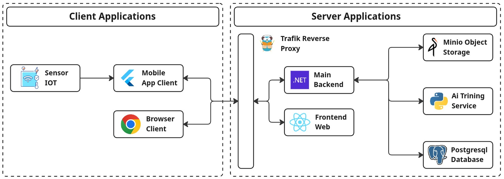

# 🌳 TBSense: Smart Plantation Management System

TBSense is an end-to-end IoT-enabled platform for monitoring, analyzing, and optimizing tree plantation operations. It integrates sensors, mobile and web clients, advanced analytics, and AI-driven yield prediction to support sustainable agriculture.

---

## 🏗️ System Architecture



**Client Applications:**
- **Sensor IoT:** Collects real-time environmental and tree data.
- **Mobile App (Flutter):** Connects to sensors via BLE, scans QR codes, and uploads data.
- **Browser Client (React):** Dashboard for monitoring, analytics, and management.

**Server Applications:**
- **Traefik Reverse Proxy:** Routes traffic to backend and frontend services.
- **Main Backend (.NET):** RESTful API for plantation management, tree monitoring, analytics, and data storage.
- **Frontend Web (React):** SPA for visualization and user interaction.
- **Minio Object Storage:** Stores files and large data objects.
- **AI Training Service (Python):** Machine learning model training and predictions.
- **PostgreSQL Database:** Stores structured plantation, tree, and metric data.

---

## 📦 Project Structure

```
tbsense-backend/           # .NET backend API & services
  └─ src/                  # Domain, endpoints, storage, trainer, etc.
tbsense-backend-ai-training-service/ # Python AI training REST API
tbsense-csv-migrator/      # Go CSV migrator for database seeding
tbsense-frontend/          # React web dashboard (SPA)
tbsense-mobile/            # Flutter mobile app for field monitoring
tbsense-hardware/          # Hardware firmware and related resources
assets/                    # System design and images
```

---

## 🚀 Key Features

### 🌱 Supported Features

- **Multi-Plantation Management**: Create and manage multiple plantations, each with detailed profiles, land area, planted date, and geospatial coordinates.
- **Tree Tracking**: Register and monitor thousands of trees per plantation, each with unique geolocation (latitude/longitude).
- **Environmental Monitoring**: Collect and analyze real-time and historical sensor data for each tree, including soil moisture, soil temperature, and air temperature.
- **Harvest Management**: Record and analyze harvest events, including yield (kg) and harvest dates for each plantation.
- **Yield Prediction (AI)**: Predict future yields using AI models, with results stored per plantation and model.
- **Geospatial Analytics**: Visualize and analyze plantation and tree locations for spatial insights.
- **Model Management**: Track and manage AI models used for predictions.
- **Knowledge Base & AI Sessions**: Support for knowledge management and interactive AI sessions.
- **Advanced Analytics**: 51+ chart endpoints for visualizing plantation, tree, and harvest data.
- **High-Performance Data Migration**: Efficiently seed the database with large CSV datasets.
- **Modern Web & Mobile Interfaces**: User-friendly dashboards and mobile apps for field and office use.

---

## 🛠️ Getting Started

### Backend (.NET)
- See `tbsense-backend/README.md` for setup, API docs, and development instructions.

### AI Training Service (Python)
- See `tbsense-backend-ai-training-service/README.md` for setup and API usage.

### CSV Migrator (Go)
- See `tbsense-csv-migrator/README.md` for seeding instructions.

### Frontend (React)
- See `tbsense-frontend/README.md` for running and building the dashboard.

### Mobile App (Flutter)
- See `tbsense-mobile/README.md` for installation and usage.

---

## 📚 Documentation
- Each module contains its own detailed README.
- API documentation and database schema are available in the backend module.